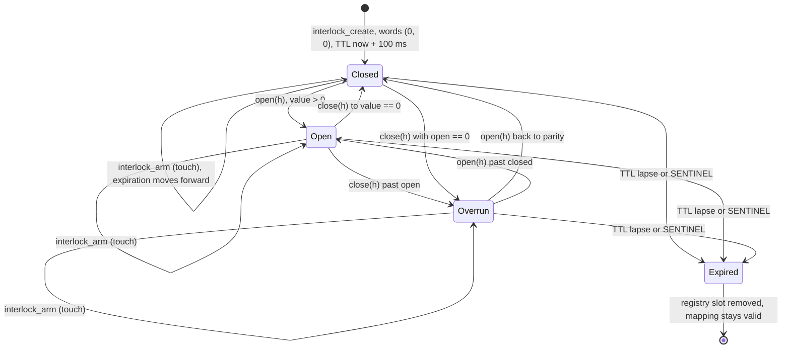

# Abacus design

How and why Abacus is shaped the way it is. The primitive, the tiers, the daemon loop, the
SDK split, and the mechanisms that make crash-only coordination work. INTERFACE.md is the frozen
contract surface; PHILOSOPHY.md is the design constitution; this file is the rationale and
mechanism between them.

## The primitive

One primitive: the interlock. Three `AtomicU64` words in a `#[repr(C)]` struct,
`abacus-core/src/interlock.rs::Interlock`: `open_count` at offset 0, `closed_count` at
offset 8, `expiration_ns` at offset 16. `INTERLOCK_SIZE` is 24 bytes, asserted at compile time
against `size_of::<Interlock>()`.

The backing is a `memfd_create` file truncated to 24 bytes and mapped `MAP_SHARED`
(`interlock_create`, `mmap_interlock`). The mapping is reference counted: `InterlockHandle`
wraps an `Arc<InterlockRegion>`, and the last clone unmaps and closes the fd
(`InterlockRegion::drop`). The fd is handed to clients by `interlock_dup_fd`, which `dup`s the
memfd so both processes map the same page.

### Stored properties

| Offset | Word | Name | Who writes it |
|---|---|---|---|
| 0 | 0 | `open_count` | tier 0: creator and attachers (`Interlock::open`, `AttachedInterlock::open`). tier 1: creator sets the target by CAS-max (`WaitCounter::wait_until`). tier 2: creator sets the absolute clock target by CAS-max (`WaitTimer::wait_ms_with_margin`); daemon seeds it at create. tier 3: daemon only (grid line). tier 4: daemon seeds 1 at create; creator increments to re-arm (`WaitBarrier::rearm`). clock: daemon only (`Registry::tick`). |
| 8 | 1 | `closed_count` | tier 0: creator and attachers (`Interlock::close`, `AttachedInterlock::close`). tiers 1 to 4: daemon only (`Registry::evaluate_all`). clock: daemon writes the start millisecond once at `Registry::with_limit`. |
| 16 | 2 | `expiration_ns` | Owner, monotonic forward only, by CAS-max (`interlock_arm`, driven by keepalive and explicit `touch`). Daemon stamps `SENTINEL` on reap (`interlock_reap`). Owner stamps `SENTINEL` on free (`interlock_free`). |

### Invariants

- Counters are monotonic and carry arbitrary increments. `handle_ops::increment` uses
  `fetch_add`.
- `expiration_ns` is `CLOCK_MONOTONIC` nanoseconds and never decreases: `interlock_arm` is a
  CAS-max loop that returns `Ok(())` when the requested deadline is already behind the current
  one.
- `SENTINEL` (`u64::MAX`) in any word means terminated. `interlock_is_terminated` reads all
  three.
- Termination cannot be undone. `handle_ops::increment` checks whether the pre-add value was
  `SENTINEL` or whether the add would cross it, restores `SENTINEL`, wakes waiters, and returns
  `SdkError::InterlockReaped`. `interlock_arm` refuses to write over a `SENTINEL` expiration.
- Values above 2^63 are outside the representable signed range; `handle_ops::value` computes
  `open - closed` with `wrapping_sub`.

### Sealing

`interlock_create` applies `F_SEAL_SHRINK | F_SEAL_GROW | F_SEAL_SEAL` before mapping. A
shrunk memfd faults every existing mapping, so a client holding a dup'd fd could kill the
daemon with one `ftruncate`. Sealing turns that into `EPERM`. `F_SEAL_SEAL` prevents a holder
from removing the other seals.

### Derived properties

| Name | Formula | Meaning |
|---|---|---|
| `value` | `(open as i64).wrapping_sub(closed as i64)` | Outstanding work. Positive = open, zero = closed, negative = overrun. `handle_ops::value`, inline in `evaluate_all`. |
| `open` (daemon) | `value > 0` | The watch is armed. Tiers 1 to 4 only fire while armed. |
| `terminated` | any word equals `SENTINEL` | `interlock_is_terminated`. |
| `alive` | `expiration_ns > now_ns` | `clock::expiration_alive`. Equality reads as dead. |
| `InterlockState` | sentinel check, then `clock_ns >= expiration_ns`, then sign of `value` | `Expired`, `Overrun`, `Open`, `Closed`. `types::interlock_state`. |
| `WaitState` | `closed == open` yields `Normal`; `closed > open` yields `Overrun`; `closed < open` yields `None` | SDK classification. `types::classify_wake`. |

### Shared memory topology

One memfd per interlock, 24 bytes, mapped once per process that holds it.

The daemon maps read-write (`PROT_READ | PROT_WRITE` via `mmap_interlock`), keeps the
`InterlockHandle` for the entry's lifetime, and hands clients a `dup` of the fd over
`SCM_RIGHTS`. The client maps through a tier-specific function in
`abacus-core/src/interlock.rs`:

- `interlock_map`: `PROT_READ | PROT_WRITE`. Bare interlocks and process clocks.
- `interlock_map_counter`, `_timer`, `_cron`, `_barrier`: `PROT_READ | PROT_WRITE`. Per-word
  write discipline is enforced by the SDK type, not by page protection.
- `interlock_map_clock`: `PROT_READ`. The only mmap-enforced restriction.

`InterlockHandle` is `Send` and `Sync`: the region is shared memory designed for concurrent
multi-process access and every access goes through atomics.

## Five tiers, one state machine

Every tier is the same 24 bytes. The tier is a property of the registry entry
(`registry.rs::Tier`), not of the memory. What changes per tier is what the daemon does with
the words each cycle (`Registry::evaluate_all`) and what the SDK lets the holder do with them.

| Tier | Daemon per cycle | SDK exposes |
|---|---|---|
| 0 Interlock | Reap only: `SENTINEL` or lapsed TTL triggers `interlock_reap` and slot removal | `create_interlock` returns `Interlock`: `open`, `close`, `peek`, `value`, `state`, `touch`, `wait_open`, `wait_close`, bounded variants, `free` |
| 1 WaitCounter | Reads watched target's word via `watched_value`; if Open and watched >= `open_count`, stores watched into `closed_count` and wakes | `create_wait_counter`, `WaitCounter::wait_until` (CAS-max target, arms 2x timeout, classifies wake); attachers get read-only `AttachedWaitCounter` |
| 2 WaitTimer | Target is the clock; when `clock_now_ms >= open_count`, stores `clock_now_ms` into `closed_count` and wakes | `create_wait_timer`, `WaitTimer::wait_ms`, `wait_ms_with_margin`, `wait_until` |
| 3 WaitCron | Same fire test as tier 2, then re-arms `open_count` to `next_grid_line(clock_now_ms, interval_ms)`; overflow reaps | `create_wait_cron`, `WaitCron::wait` reports `Normal` when `completed_at % interval_ms == 0`, `Overrun` otherwise |
| 4 WaitBarrier | Evaluates every `(target, word, threshold)` condition; any dead target reaps, all met and Open stamps `closed_count = open_count` and wakes | `create_wait_barrier`, `WaitBarrier::wait` and `rearm` |

The gate common to tiers 1 to 4 is "Open": `value > 0`. Target liveness is checked regardless,
so an idle watcher still dies with its target.

Initialization per tier in `Registry::create`: WaitTimer starts both words at the current
clock ms, WaitCron starts `open_count` at the next grid line and `closed_count` at the clock,
WaitBarrier starts `(1, 0)` so it is Open immediately, tiers 0 and 1 start `(0, 0)`.

### States

**Closed.** `value == 0`, alive and unstamped. A fresh interlock enters here:
`interlock_create` writes (0, 0) and `expiration_ns = now + CREATION_TTL_NANOS`. Re-entered
whenever `closed_count` catches up to `open_count`. A tier 1 to 4 object in this state is not
evaluated for firing because `open` is false.

**Open.** `value > 0`. Entered by `increment` on `Word::Open`, by a tier 1 or 2 target CAS,
by the daemon seeding a cron grid line, or by a barrier re-arm. For tiers 1 to 4 this is the
armed state.

**Overrun.** `value < 0`. Entered when `closed_count` passes `open_count`. Informational only;
the daemon does not reap on overrun.

**Expired.** Either any word equals `SENTINEL`, or `!expiration_alive(exp, now_ns)`. On the
daemon side, entry runs `interlock_reap` (all three words to `SENTINEL`, both counters woken),
then `remove_slot` drops the registry entry. The shared mapping remains valid for every holder;
they read `SENTINEL` and report `InterlockReaped`.

## The clock

The daemon owns one interlock named `clock` at registry id 0 (`CLOCK_NAME`, `CLOCK_ID`).
`Registry::with_limit` creates it through `interlock_create_clock`, stores the daemon start
time in milliseconds into both words, and arms it with `CLOCK_TTL_NANOS` (100 ms).

Each cycle `Registry::tick` stores `now_ns / NANOS_PER_MS` into `open_count`, runs
`evaluate_all`, wakes `open_count`, and re-arms via `refresh_clock_expiration`. The clock lives
outside the slab, so `evaluate_all` never sees it and it is never reaped.

Because it is the same primitive, a WaitTimer is a WaitCounter on `clock.open_count`:
`Registry::create` for `Tier::WaitTimer` sets
`watch = Some((Target::Clock, WatchedWord::OpenCount))`, and `Registry::resolve` maps the name
`clock` to `Target::Clock`. A client can also name `clock` as the watched interlock of an
ordinary WaitCounter.

### Clock protections

- `interlock_create_clock` maps read-write first, then applies
  `F_SEAL_SHRINK | F_SEAL_GROW | F_SEAL_FUTURE_WRITE | F_SEAL_SEAL`.
  `F_SEAL_FUTURE_WRITE` (declared locally as `0x0010`) leaves the daemon's existing writable
  mapping intact and blocks any new writable mapping.
- Clients map through `interlock_map_clock` with `PROT_READ` only.
- `AbacusClient::attach_interlock` rejects the name `clock` with `InvalidRequest`;
  `Registry::create` rejects `clock` as a reserved name.

The clock handle is attached once on connect and exposed as the read-only `ClockHandle`.

The clock is read-only for clients because every reader in the system derives time from it.
`WaitTimer` computes its target from `clock.open_count`, `WaitBarrier::wait` reports
`completed_at` from it, `ProcessClock` stamps it into its own `open_count`, and the daemon
fires every tier 2 and tier 3 interlock against it. A single writable client could move the
whole system's clock.

## Daemon evaluation

### The loop

`daemon::daemon_run_with` anchors on `monotonic_now_nanos()` at startup and sets
`next_due = anchor + NANOS_PER_MS`. Each iteration:

1. Check the stop flag (`AtomicBool`, set by the `SIGTERM`/`SIGINT` handler with `sa_flags = 0`,
   no `SA_RESTART`, so `ppoll` returns `EINTR` and the flag is seen at once).
2. Compute `timespec_from_nanos(next_due.saturating_sub(now))` and `ppoll` over the listener
   fd plus every client fd. Behind schedule means a zero timeout.
3. Accept every pending connection (non-blocking), service readable clients before hangups.
4. Drop clients whose `revents` carry `POLLHUP`/`POLLERR`/`POLLNVAL` or whose
   `service_client` returns `ClientOutcome::Drop`.
5. If `now >= next_due`, call `registry.tick(now)` and recompute
   `next_due = anchor + ((now - anchor) / NANOS_PER_MS + 1) * NANOS_PER_MS`.

Precision comes from three places: `ppoll` with a nanosecond `timespec` rather than a
millisecond poll timeout; `prctl(PR_SET_TIMERSLACK, 1)` to drop the default 50 us slack; and
deriving `next_due` from the fixed anchor, so cycle boundaries stay on the grid regardless of
how long any one cycle took.

The recomputation is the catch-up rule: a stall of N milliseconds skips directly to the next
boundary after now instead of firing N times in a burst. Early wakes for client I/O do not
consume a boundary: the loop services the socket, finds `now < next_due`, and does not tick.

The clock advance and every tier evaluation happen inside `tick`, so the clock word and the
delivery it triggers are written in the same pass.

### Clock advancement

`Registry::tick(now_ns)` computes `current_ms = now_ns / NANOS_PER_MS`, stores it into
`clock.open_count` with `Ordering::Release`, runs `evaluate_all(current_ms, now_ns)`,
futex-wakes `open_count`, and calls `refresh_clock_expiration` (re-arms for 100 ms).

Precision is one millisecond, truncated from `CLOCK_MONOTONIC` nanoseconds.
`monotonic_now_nanos` aborts the process if `clock_gettime` fails. The anchor is
`CLOCK_MONOTONIC` itself: `open_count` is the absolute monotonic millisecond.
`closed_count` is the start millisecond and never moves, so `open_count - closed_count` is
daemon uptime.

### Evaluation order

`registry.rs::evaluate_all(clock_now_ms, now_ns)` walks every slot in index order. For each
live entry:

1. Load all three words with `Ordering::Acquire`.
2. Sentinel check. If any word equals `SENTINEL`, call `interlock_reap`, push to `dead`,
   `continue`. Runs before TTL check because a freed object's `expiration_ns` is `SENTINEL`,
   which as a raw number would read as alive under `expiration_alive`.
3. TTL check. If `!expiration_alive(exp, now_ns)` (that is, `exp <= now_ns`), reap, mark dead,
   `continue`. Runs before tier logic so a lapsed object never fires.
4. Compute `value` and `open = value > 0`.
5. Tier dispatch:
   - **Interlock:** nothing.
   - **WaitTimer:** if `open && clock_now_ms >= open_count`, store `clock_now_ms` into
     `closed_count`, futex-wake.
   - **WaitCron:** if `open && clock_now_ms >= open_count`, store `clock_now_ms` into
     `closed_count`, futex-wake, re-arm to `next_grid_line(clock_now_ms, interval_ms)`;
     overflow reaps.
   - **WaitCounter:** resolve watch via `watched_value(target, word)`. `None` (slot empty,
     id mismatch, or any word is `SENTINEL`) means target gone: reap the watcher. On
     `Some(watched)` and `open && watched >= open_count`, store `watched` into `closed_count`,
     futex-wake.
   - **WaitBarrier:** iterate conditions via `watched_value`. Any `None` sets `target_gone`
     and reaps immediately. Otherwise, if `open && all_met`, store `open_count` into
     `closed_count`, futex-wake.
6. After the sweep, drain `dead` through `remove_slot` (reap again idempotently, remove name,
   return slot to free list, decrement `live`).

The clock is not in `slots` and is never evaluated or reaped by this loop.

## Per-tier composition

### Interlock (tier 0)

`Tier::Interlock` has an empty match arm in `evaluate_all`. The daemon reaps on sentinel or
lapsed TTL and does nothing else: no watch, no stamp. Both counters are writable by the
creator and by any attacher. Waiters block directly on counter words via
`handle_ops::wait_word`, which re-checks sentinel and expiration on every pass and sleeps at
most `DEFAULT_TIMEOUT_NANOS` (100 ms) per futex call.

### WaitCounter (tier 1)

Watches one word (`OpenCount` or `ClosedCount`) of one other interlock, named at create time
and resolved by `Registry::resolve` into `Target::Clock` or `Target::Slot { slot, id }`.
Identity, not name: `watched_value` compares `entry.id != id`, returning `None` on mismatch.
Because ids are strictly increasing, a name recreated over the old one produces a new id and
the old watcher's target resolves to `None`.

The daemon stamps `closed_count` with the watched value (not the target), so an overshoot is
visible as `Overrun`. It fires when `open && watched >= open_count`. If the target is reaped,
freed, or recreated, `watched_value` returns `None` and the watcher is reaped in the same
pass, even if idle.

SDK: `WaitCounter::wait_until(target, timeout_ms)` CAS-maxes `target` into `open_count`, arms
TTL to `2 * timeout_ms`, then loops on `closed_count` with `futex_wait` bounded at
`timeout_ms`, returning `WaitState::Timeout` on the pass after `ETIMEDOUT` if nothing was
delivered.

### WaitTimer (tier 2)

Created with `watch = Some((Target::Clock, WatchedWord::OpenCount))` and both counters seeded
to the current clock millisecond. The daemon fires when `open && clock_now_ms >= open_count`
and stamps `closed_count` with `clock_now_ms` (same discipline as tier 1: watched value, not
target), so a late wake reads as `Overrun`.

SDK: `WaitTimer::wait_ms_with_margin(ms, margin_ms)` reads the clock, returns immediately with
`Normal` if `ms == 0`, rejects `margin_ms <= ms`, CAS-maxes `clock_now + ms` into
`open_count`, arms TTL to `margin_ms`, and loops on `closed_count`. If `now_ns >= deadline_ns`
without delivery, `on_timeout` applies the policy: `TimeoutPolicy::Error` returns
`SdkError::DeliveryTimeout`; `TimeoutPolicy::Abort` (default) prints diagnostics and calls
`std::process::abort()`. The margin defaults to `max(2 * ms, MIN_FATAL_MARGIN_MS)` where
`MIN_FATAL_MARGIN_MS` is 50. A daemon restart is discovered exactly here: nobody stamps and the
margin expires.

### WaitCron (tier 3)

Also watches `Target::Clock / OpenCount`, with an `interval_ms` derived from the wire's
`interval_ns` (registry rejects zero and anything under 1 ms). At create, `closed_count` is
the current clock millisecond and `open_count` is `next_grid_line(clock_now_ms, interval_ms)`.

`next_grid_line(now_ms, interval_ms)` is
`(now_ms / interval_ms).checked_add(1)?.checked_mul(interval_ms)`: checked arithmetic, returns
the first grid line strictly after `now_ms`.

Firing and re-arm in one step: stamp `closed_count = clock_now_ms`, wake, store
`next_grid_line(clock_now_ms, interval_ms)` into `open_count`. Overflow reaps.

Missed grid lines are skipped, not replayed. Re-arm is computed from `clock_now_ms`, not the
previous target, so a stall across N lines produces one stamp and one re-arm forward. The SDK
reads the skew: `WaitCron::wait` reports `Normal` when `closed % interval_ms == 0` and
`Overrun` otherwise.

### WaitBarrier (tier 4)

Created with a non-empty vector of `(name, watched_word, threshold)` conditions, each name
resolved to a `Target` at create time (identity-tracked like a tier 1 watch). The daemon seeds
`open_count = 1`, `closed_count = 0`, so the barrier is born armed.

`evaluate_all` iterates the conditions: any unresolvable target reaps immediately; any
`watched < threshold` clears `all_met`. Fires only when `open && all_met`, stamping
`closed_count = open_count` exactly. That exactness lets `WaitBarrier::wait` treat
`closed >= open` as delivery and always report `Normal` with `completed_at` from the clock.

Re-arm is `WaitBarrier::rearm`: increment `open_count` by 1, restoring `open > closed`.

## SDK-only compositions

### WaitRace

`wait_race::WaitRace` takes a vector of `WaitCounter` handles, snapshots each `closed_count`,
and polls: for each counter, checks `is_reaped()` (returning `InterlockReaped` for the whole
race if any member died) and `peek()`, returning `(index, WaitResult)` for the first counter
whose `closed_count` exceeds its snapshot. Sleeps 1 ms between passes. SDK-only because the
daemon has no tier for "fire when any of N fires."

### ProcessClock

A liveness beacon built from a tier 0 interlock. At construction it reads the daemon clock's
`open_count` and writes that value into both `closed_count` (fixed start time) and
`open_count` (initial last-seen). Registers with `Keepalive::register_with_clock`, so the
keepalive worker arms the TTL and copies the daemon clock millisecond into `open_count` each
interval. `uptime_ms()` is `last_seen - start`, stopping the moment the owning process stops
its keepalive. Any other process can watch it with a `WaitCounter` on `OpenCount`.

## Daemon and SDK split

The daemon is the loop; the SDK is everything a client can do without one.

The daemon decides: whether a name can be created (validates name length, reserved name,
interlock cap, per-tier fields), what a watcher watches (`Registry::resolve` binds a name to
`Target::Slot { slot, id }` at create time), when a wait condition holds, when an interlock
dies, and what the current time is.

The SDK handles locally: futex waits (each tier's loop with its own classification), keepalive,
timeout policy, target arithmetic (CAS-max), and wake classification.

The split is where the shared memory ends. Anything that can be done by reading or writing the
three words is done in the client's process with no syscall to the daemon. The UDS round trip
exists only to create or attach a name and receive an fd. After that the socket carries
nothing: a `WaitCron` loop calls `wait()` forever with no further round trips, because the
daemon re-arms it in shared memory.

### SDK state interpretation

`classify_wake(open, closed)` is the whole classification:

- `closed == open`: `Some(Normal)`, delivered exactly at the target.
- `closed > open`: `Some(Overrun)`, delivered past the target.
- `closed < open`: `None`, not yet delivered.

`WaitState::Timeout` is never produced by `classify_wake`. It is synthesized by the waiter when
its own bound expires without delivery.

The sentinel check always precedes classification. Every wait loop loads both counters and
returns `InterlockReaped` if either is `SENTINEL` before calling `classify_wake`. The
expiration word is also checked: `SENTINEL` or a lapsed deadline yields `InterlockReaped`.

## TTL and keepalive

Liveness is a deadline in the third word. An owner that stops extending it is dead by
definition.

`Keepalive::register_inner` floors the requested TTL at `2 * interval_ms`, arms it
synchronously via `interlock_arm` before returning, pushes an `Entry` with
`next_due_ns = now + interval_ns`, and starts the thread if not running.

Defaults from `types`:

- `DEFAULT_TOUCH_INTERVAL_MS = 40`.
- `default_touch_ttl_ms(interval)` is `max(5 * interval, MIN_TOUCH_TTL_MS)`;
  `MIN_TOUCH_TTL_MS = 200`, so `DEFAULT_TOUCH_TTL_MS = 200` (compile-time assertion).
  The floor exists because a consumer stalled by CFS quota throttling (100 ms period) must
  survive a full period plus scheduling slack.
- `CREATION_TTL_NANOS = 100_000_000` (100 ms): what a fresh interlock carries before any
  keepalive arm.

The keepalive thread is consolidated: one per `Keepalive`, one per `AbacusClient`.
`touch::run` walks the entry list, arms each due entry, computes the earliest next due (capped
at `IDLE_SLEEP`, 100 ms), and sleeps on a `Condvar`. An entry whose `interlock_arm` returns
`InterlockReaped` is flagged and removed. The thread holds only a `Weak<Inner>` and exits when
the last strong reference drops.

## Death detection

An owner that dies stops touching. Nothing else happens, and nothing else needs to.

Each cycle `evaluate_all` reads all three words. If any is `SENTINEL` or
`expiration_alive(exp, now_ns)` is false, it calls `interlock_reap` (all three words to
`SENTINEL`, both counters woken), marks the slot dead, and `remove_slot` returns it to the
free list.

A peer sees this in one of three ways, all from shared memory:

- Blocked in a wait: `futex_wake` returns the waiter, which reads `SENTINEL` and returns
  `InterlockReaped`.
- Polling: `interlock_is_terminated` or `state()` reads `Expired`.
- Watching: a `WaitCounter` or `WaitBarrier` whose target is gone gets `None` from
  `watched_value` and is reaped in the same pass.

An attacher terminates through a counter instead: `AttachedInterlock::free` stores `SENTINEL`
into `open_count` and wakes both words.

Detection is bounded by the TTL plus one cycle. With defaults (200 ms TTL, 1 ms cycle) the
daemon reaps within roughly 200 ms. The failure mode is latency, not incorrectness, because
`expiration_ns` is absolute.

Waiters have their own escape hatch: `WaitTimer::wait_ms_with_margin` arms its own deadline to
the margin (`max(2 * W, MIN_FATAL_MARGIN_MS)`), and when the deadline passes with nothing
delivered, calls `on_timeout`. A daemon that stops delivering is discovered by the client on
its own clock.

### Self-reaping on name recreation

Names are claimed by creation, not by negotiation. `Registry::create` looks up the name and,
if present, calls `remove_slot` on the old slot before installing the new entry.

The invariants this enforces:

- Every old handle sees a terminal state.
- The new handle is fresh: new memfd, new id from `next_id` (only increases).
- Watchers do not retarget: `watched_value` compares the stored id against the occupant's id
  and returns `None` on mismatch, reaping the watcher.
- The cap is not consumed twice: `Registry::create` skips the limit check when the name exists,
  and `remove_slot` decrements `live` before the new entry is pushed.

This is the right behavior for crash-only systems: the restarting process creates its name,
whatever held it before is terminated, and every holder learns from the memory it already has
mapped. No reconnection handshake, no ownership lease, no state to reconcile.

## Trust model

The system trusts local processes that can open the socket. It does not trust them with the
daemon's life.

What a local process can do: connect, create and attach by name, receive a dup'd memfd, read
and write any interlock it holds, terminate any it holds (via `expiration_ns` as creator, via
`open_count` as attacher), claim any name including one another process is using, send
arbitrary bytes.

What it cannot do: shrink or grow a memfd (sealed), map the clock writable
(`F_SEAL_FUTURE_WRITE`), create a name `clock`, exceed `MAX_NAME_LEN` (255) or the interlock
cap (default 4096), pass fds into the daemon (no control buffer on reads), force allocation on
a declared length (prefix rejected before reading), or hold the loop hostage (one non-blocking
read per client per cycle into a bounded buffer).

Protocol faults end the connection: one `Response::invalid_request` best effort, then drop.
A client not draining its socket is broken and is dropped. A disconnect is not a reap; the
client's interlocks die by TTL or not at all.

The socket permission model is filesystem permissions: `Server::create` refuses a live-daemon
path, refuses a non-socket path, unlinks a stale socket, then applies `chown`/`chmod`.
`Server::drop` removes the socket file.

That boundary is right because the socket only hands out fds to shared memory already sealed
against the one operation that could hurt a peer. The failure mode of abuse is a terminated
interlock, which every holder is built to survive.

## Out of scope

The daemon does not persist anything. A restart comes back empty. Waiters discover it through
their own fatal margin or poll cadence; the daemon wakes nobody on the way down.

The daemon does not track ownership. `service_client` removes a hung-up client from the poll
set and nothing else; interlocks die by TTL.

The futex compares 32 bits. `futex_word` takes the low half, guarded by a compile-time
little-endian assertion. An increment exactly at 2^32 in the load-to-syscall window costs one
poll cadence and nothing more.

Details in BACKLOG.md.
