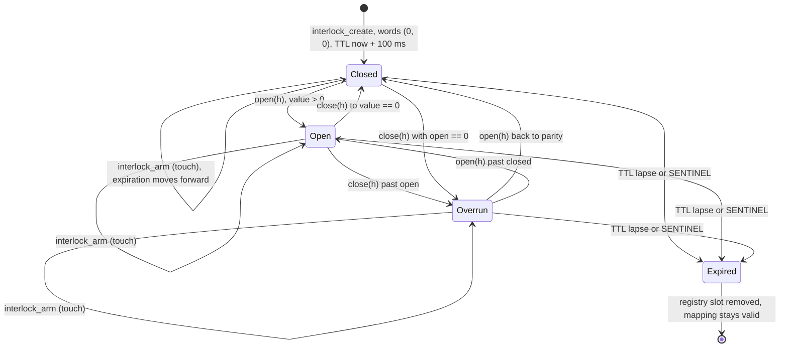

# Abacus RTS state machine

The interlock is one primitive with one state machine. Every wait tier is the same three
words with a daemon-evaluated watch on top. The daemon evaluates; the SDK interprets.

## The state machine

### Stored properties

`abacus-core/src/interlock.rs::Interlock` is a `#[repr(C)]` struct of three `AtomicU64`
words mapped from a sealed memfd. `INTERLOCK_SIZE` is 24; offsets are 0, 8, 16.

| Offset | Word | Type | Name | Who writes it |
|---|---|---|---|---|
| 0 | 0 | `AtomicU64` | `open_count` | tier 0: creator and attachers (`interlock.rs::Interlock::open`, `AttachedInterlock::open`). tier 1: creator sets the target by CAS-max (`wait_counter.rs::WaitCounter::wait_until`). tier 2: creator sets the absolute clock target by CAS-max (`wait_timer.rs::WaitTimer::wait_ms_with_margin`); daemon seeds it at create (`registry.rs::Registry::create`). tier 3: daemon only (grid line, `registry.rs::Registry::create` and `evaluate_all`). tier 4: daemon seeds 1 at create; creator increments to re-arm (`wait_barrier.rs::WaitBarrier::rearm`). clock: daemon only (`registry.rs::Registry::tick`). |
| 8 | 1 | `AtomicU64` | `closed_count` | tier 0: creator and attachers (`interlock.rs::Interlock::close`, `AttachedInterlock::close`). tiers 1 to 4: daemon only (`registry.rs::Registry::evaluate_all`). clock: daemon writes the start millisecond once at `Registry::with_limit`. |
| 16 | 2 | `AtomicU64` | `expiration_ns` | Owner, monotonic forward only, by CAS-max (`abacus-core/src/interlock.rs::interlock_arm`, driven by `touch.rs::run` and the explicit `touch` methods). Daemon stamps `SENTINEL` on reap (`interlock_reap`). Owner stamps `SENTINEL` on free (`interlock_free`). |

`SENTINEL` is `u64::MAX` and is reserved in all three words
(`abacus-core/src/interlock.rs::SENTINEL`). Creation TTL is 100 ms
(`CREATION_TTL_NANOS`); the clock's TTL is 100 ms (`registry.rs::CLOCK_TTL_NANOS`).

### Derived properties

| Name | Formula | Meaning |
|---|---|---|
| `value` | `(open as i64).wrapping_sub(closed as i64)` | Outstanding work. Positive means open, zero means closed, negative means overrun. Computed in `abacus-client/src/handle_ops.rs::value` and inline in `registry.rs::evaluate_all`. |
| `open` (daemon-side) | `value > 0` | The watch is armed. A tier 1 to 4 object only fires while armed. `registry.rs::evaluate_all`. |
| `terminated` | `open == SENTINEL \|\| closed == SENTINEL \|\| expiration_ns == SENTINEL` | Any single sentinel word terminates the object. `abacus-core/src/interlock.rs::interlock_is_terminated`. |
| `alive` | `expiration_ns > now_ns` | TTL has not lapsed. `abacus-core/src/clock.rs::expiration_alive`. Equality reads as dead. |
| `InterlockState` | sentinel check, then `clock_ns >= expiration_ns`, then sign of `value` | `Expired`, `Overrun`, `Open`, `Closed`. `abacus-client/src/types.rs::interlock_state`. |
| `WaitState` | `closed == open` yields `Normal`; `closed > open` yields `Overrun`; `closed < open` yields `None` (not yet delivered) | SDK classification of a wake. `abacus-client/src/types.rs::classify_wake`. |

### States

Entry into each state, as the code computes it:

**Closed.** `value == 0` and the object is alive and unstamped. A fresh interlock enters
here: `interlock_create` writes (0, 0) and `expiration_ns = now + CREATION_TTL_NANOS`. It
is re-entered whenever `closed_count` catches up to `open_count`. It means no outstanding
work and no armed watch; a tier 1 to 4 object in this state is not evaluated for firing
because `open` is false.

**Open.** `value > 0`. Entered by `Interlock::open` or `AttachedInterlock::open`
(`handle_ops.rs::increment` on `Word::Open`), by a tier 1 or 2 target CAS
(`WaitCounter::wait_until`, `WaitTimer::wait_ms_with_margin`), by the daemon seeding a cron
grid line, or by a barrier re-arm. For tiers 1 to 4 this is the armed state: the daemon
will evaluate the watch and may stamp `closed_count`.

**Overrun.** `value < 0`. Entered when `closed_count` passes `open_count`: an overshooting
`close`, or a daemon stamp that writes the watched value rather than the target
(`evaluate_all` tier `WaitCounter` stores `watched`, which may exceed `open_count`). It is
informational only. The daemon does not reap on overrun; `registry.rs::evaluate_all` has no
overrun branch.

**Expired.** Entered on either of two conditions, checked in that order in `evaluate_all`:
any word equals `SENTINEL`, or `!expiration_alive(exp, now_ns)`. Also entered locally by
`interlock_free` (writes `SENTINEL` to `expiration_ns` only, wakes both counters) and by
`AttachedInterlock::free` (writes `SENTINEL` to `open_count`, wakes both counters). On the
daemon side, entry runs `interlock_reap`, which stamps all three words with `SENTINEL` and
futex-wakes `open_count` and `closed_count`, then `remove_slot` drops the registry entry,
frees the name, and pushes the slot onto the free list. The shared mapping remains valid
for every holder; they read `SENTINEL` and report `InterlockReaped`.

### Evaluation order

`abacus-daemon/src/registry.rs::evaluate_all(clock_now_ms, now_ns)` walks every slot in
index order and, for each live entry, does exactly this:

1. Load all three words with `Ordering::Acquire`: `open_count`, `closed_count`,
   `expiration_ns`.
2. Sentinel check. If any of the three equals `SENTINEL`, call `interlock_reap`, push the
   slot to `dead`, and `continue`. This runs before the TTL check because a freed or reaped
   object's `expiration_ns` is `SENTINEL`, which as a raw number is the largest possible
   value and would read as alive under `expiration_alive`.
3. TTL check. If `!expiration_alive(exp, now_ns)` (that is, `exp <= now_ns`), reap, mark
   dead, `continue`. This runs before any tier logic so that a lapsed object is never
   allowed to fire.
4. Compute `value = (open as i64).wrapping_sub(closed as i64)` and `open = value > 0`.
5. Tier dispatch on `entry.tier`:
   - `Interlock`: nothing.
   - `WaitTimer`: if `open && clock_now_ms >= open_count`, store `clock_now_ms` into
     `closed_count` and futex-wake it.
   - `WaitCron`: if `open && clock_now_ms >= open_count`, store `clock_now_ms` into
     `closed_count`, futex-wake, then re-arm by `next_grid_line(clock_now_ms, interval_ms)`;
     on checked-arithmetic overflow, reap and mark dead.
   - `WaitCounter`: resolve the watch through `watched_value(target, word)` first. `None`
     (slot empty, id mismatch, or any of the three words is `SENTINEL`) means the target is gone:
     reap the watcher and mark it dead. Only on `Some(watched)` and `open && watched >= open_count`
     does it store `watched` into `closed_count` and futex-wake. Target liveness is checked
     before firing so a watcher can never fire against a dead or recreated target.
   - `WaitBarrier`: iterate the conditions, resolving each through `watched_value`. Any
     `None` sets `target_gone` and breaks immediately; any `watched < threshold` clears
     `all_met`. If `target_gone`, reap and mark dead. Otherwise, if `open && all_met`, store
     `open_count` into `closed_count` (exact stamp) and futex-wake.
6. After the sweep, drain `dead` through `remove_slot`, which reaps again (idempotent),
   removes the name from the index if it still points at that slot, returns the slot to the
   free list, and decrements `live`.

The clock is not in `slots` and is therefore never evaluated or reaped by this loop.

## Daemon evaluation (once per 1 ms boundary)

### Clock advancement

`abacus-daemon/src/registry.rs::Registry::tick(now_ns)` is the only writer of the clock's
`open_count`. It computes `current_ms = now_ns / NANOS_PER_MS`, stores it with
`Ordering::Release`, runs `evaluate_all(current_ms, now_ns)`, futex-wakes `open_count`, and
then calls `refresh_clock_expiration`, which re-arms the clock for `CLOCK_TTL_NANOS` (100 ms).

Precision is one millisecond, truncated from `CLOCK_MONOTONIC` nanoseconds
(`abacus-core/src/clock.rs::monotonic_now_nanos`, which aborts the process if
`clock_gettime` fails or returns an unrepresentable timespec). The anchor is `CLOCK_MONOTONIC`
itself, not the daemon start: `open_count` is the absolute monotonic millisecond.
`closed_count` is written once, at `Registry::with_limit`, to the monotonic millisecond of
daemon start and never moves again, so `open_count - closed_count` is daemon uptime in
milliseconds. The clock memfd is sealed with `F_SEAL_FUTURE_WRITE` in addition to shrink,
grow, and seal (`abacus-core/src/interlock.rs::interlock_create_clock`), so handed-out
descriptors can only be mapped `PROT_READ` (`interlock_map_clock`).

### Cycle timing

`abacus-daemon/src/daemon.rs::daemon_run_with` reads `anchor = monotonic_now_nanos()` once
at startup and sets `next_due = anchor + NANOS_PER_MS`. It calls `prctl(PR_SET_TIMERSLACK, 1)`
so the kernel does not round the sleep up.

Each iteration:

1. Check the stop flag.
2. Compute `timeout = timespec_from_nanos(next_due.saturating_sub(monotonic_now_nanos()))`
   (`abacus-core/src/clock.rs::timespec_from_nanos`, seconds plus nanoseconds).
3. Clear `revents` on every pollfd, then `ppoll(pollfds, len, &timeout, NULL)`. A negative
   return with errno other than `EINTR` is fatal and returns `StartupError::EventLoopFailed`;
   `EINTR` is swallowed.
4. If the listener is readable, accept in a loop until `Ok(None)`, setting each new
   connection nonblocking.
5. Service readable clients; drop clients whose `revents` carry `POLLHUP`, `POLLERR`, or
   `POLLNVAL`, and clients whose `service_client` returns `ClientOutcome::Drop`.
6. Re-read the clock. Only if `now >= next_due` does it call `registry.tick(now)` and then
   recompute `next_due = anchor + ((now - anchor) / NANOS_PER_MS + 1) * NANOS_PER_MS`.

That recomputation is the catch-up rule: `next_due` is derived from the anchor and current
wall time, not by adding 1 ms to the previous deadline, so a stall of N milliseconds skips
directly to the next boundary after now instead of firing N times in a burst. Early wakes
are handled by step 6: client I/O returns from `ppoll` before the boundary, the loop services
the socket, finds `now < next_due`, and does not tick. The boundary is never advanced by
client activity, and the next `ppoll` timeout is the remaining fraction of the millisecond.

## Type composition

### Interlock (tier 0)

`Tier::Interlock` in `registry.rs::evaluate_all` has an empty match arm. The daemon reaps on
sentinel or lapsed TTL and does nothing else: no watch, no stamp. Both counters are writable
by the creator (`abacus-client/src/interlock.rs::Interlock`) and by any attacher
(`AttachedInterlock`). Waiters block directly on the counter words via
`handle_ops.rs::wait_word`, which re-checks the sentinel and the expiration on every pass
and sleeps at most `DEFAULT_TIMEOUT_NANOS` (100 ms) per futex call.

### WaitCounter (tier 1)

Watches one word (`OpenCount` or `ClosedCount`) of one other interlock, named at create time
and resolved by `registry.rs::Registry::resolve` into `Target::Clock` or
`Target::Slot { slot, id }`. Identity, not name: `registry.rs::watched_value` looks up the
slot and compares `entry.id != id`, returning `None` on mismatch. Because ids are allocated
strictly increasing from `next_id`, a name recreated over the old one produces a new id, and
the old watcher's target resolves to `None`.

It stamps `closed_count` with the watched value (not the target), so an overshoot is visible
to the SDK as `Overrun`. It fires when `open && watched >= open_count`, that is, when the
watcher is armed and the watched word has reached or passed the target.

If the target is reaped, freed, or recreated, `watched_value` returns `None` and the watcher
itself is reaped and removed in the same `evaluate_all` pass
(`registry.rs::Registry::evaluate_all`, `Tier::WaitCounter`, the `None` arm). This holds even
for an idle watcher that has never been armed.

SDK side: `abacus-client/src/wait_counter.rs::WaitCounter::wait_until(target, timeout_ms)`
CAS-maxes `target` into `open_count`, arms the TTL to `2 * timeout_ms`, then loops on
`closed_count` with `futex_wait` bounded at `timeout_ms`, returning `WaitState::Timeout` on
the pass after `ETIMEDOUT` if nothing was delivered.

### WaitTimer (tier 2)

Created with `watch = Some((Target::Clock, WatchedWord::OpenCount))` and both counters seeded
to the current clock millisecond (`registry.rs::Registry::create`). The daemon fires when
`open && clock_now_ms >= open_count` and stamps `closed_count` with `clock_now_ms`, which is
the same stamping discipline as tier 1 (the watched value, not the target), so a late wake
reads as `Overrun`.

`abacus-client/src/wait_timer.rs::WaitTimer::wait_ms_with_margin(ms, margin_ms)` reads the
clock, returns immediately with `Normal` if `ms == 0`, rejects `margin_ms <= ms` as
`InvalidRequest`, CAS-maxes `clock_now + ms` into `open_count`, arms the interlock TTL to
`margin_ms`, and computes a local `deadline_ns`. It then loops on `closed_count`. If
`now_ns >= deadline_ns` without delivery, `on_timeout` applies the policy: `TimeoutPolicy::Error`
returns `SdkError::RtsTimeout`; `TimeoutPolicy::Abort` (the default) prints the wait, target,
and both counters to stderr and calls `std::process::abort()`. The margin defaults to
`max(2 * ms, MIN_FATAL_MARGIN_MS)` where `MIN_FATAL_MARGIN_MS` is 50
(`wait_timer.rs::WaitTimer::margin_for`, `types.rs::MIN_FATAL_MARGIN_MS`). A daemon restart is
discovered exactly here: the fresh daemon knows nothing of the old timer, nobody stamps, and
the margin expires.

### WaitCron (tier 3)

Also watches `Target::Clock` / `OpenCount`, but with an `interval_ms` derived from the wire's
`interval_ns` (`registry.rs::Registry::create` rejects zero and anything under 1 ms). At
create, `closed_count` is set to the current clock millisecond and `open_count` to
`next_grid_line(clock_now_ms, interval_ms)`.

`registry.rs::next_grid_line(now_ms, interval_ms)` is
`(now_ms / interval_ms).checked_add(1)?.checked_mul(interval_ms)`: checked arithmetic at both
steps. It returns the first grid line strictly after `now_ms`.

Firing and re-arm happen in one step in `evaluate_all`: stamp `closed_count = clock_now_ms`,
wake, then store `next_grid_line(clock_now_ms, interval_ms)` into `open_count`. If the
checked arithmetic overflows, the cron is reaped and removed instead.

Missed grid lines are skipped, not replayed. Because re-arm is computed from `clock_now_ms`
and not from the previous target, a stall across N lines produces one stamp (at the late
clock value) and one re-arm to the next line after that clock value. There is no burst. The
SDK reads the skew: `abacus-client/src/wait_cron.rs::WaitCron::wait` reports `Normal` when
`closed % interval_ms == 0` and `Overrun` otherwise.

### WaitBarrier (tier 4)

Created with a non-empty vector of `(name, watched_word, threshold)` conditions, each name
resolved to a `Target` at create time (so every condition is identity-tracked like a tier 1
watch). The daemon seeds `open_count = 1`, leaving `closed_count = 0`, so the barrier is born
armed.

`evaluate_all` iterates the conditions: any unresolvable target sets `target_gone` and breaks
out, causing an immediate reap; any `watched < threshold` clears `all_met`. It fires only
when `open && all_met`, and stamps `closed_count = open_count` exactly. That exactness is
what makes `abacus-client/src/wait_barrier.rs::WaitBarrier::wait` able to treat `closed >= open`
as delivery and always report `WaitState::Normal` with `completed_at` read from the clock.

Re-arm is `WaitBarrier::rearm`, which increments `open_count` by 1 through
`handle_ops::increment`, restoring `open > closed` and making the barrier eligible to fire
again at the next boundary where all conditions still hold.

### Deferred compositions

Boolean compositions (WaitAnd, WaitOr, WaitXor, WaitNand) require wire v2 tier discriminants,
because `Tier::from_wire` in `registry.rs` accepts only 0 through 4 and the v1 `Attached`
response carries no tier.

### SDK-only compositions

`abacus-client/src/wait_race.rs::WaitRace` takes a vector of `WaitCounter` handles, snapshots
each `closed_count`, and then polls: for each counter, it checks `is_reaped()` (returning
`SdkError::InterlockReaped` for the whole race if any member died) and `peek()`, returning
`(index, WaitResult)` for the first counter whose `closed_count` exceeds its snapshot. Between
passes it sleeps `Duration::from_millis(1)`. The cost is one thread wake per millisecond plus
a linear scan proportional to the number of raced counters, and the failure mode is coarse:
one reaped member fails the whole race. It is SDK-only because the daemon has no tier for
"fire when any of N fires"; that would be `WaitOr` under wire v2.

`abacus-client/src/process_clock.rs::ProcessClock` is a liveness beacon built from a tier 0
interlock. At construction it reads the daemon clock's `open_count` and writes that value into
both `closed_count` (the fixed start time) and `open_count` (the initial last-seen). It then
registers with `Keepalive::register_with_clock`, so the keepalive worker
(`abacus-client/src/touch.rs::run`) does two things each interval: arm the TTL, and copy the
current daemon clock millisecond into `open_count`. `uptime_ms()` is therefore
`last_seen - start`, a value that stops advancing the moment the owning process stops running
its keepalive thread. Any other process can watch it with a `WaitCounter` on `OpenCount`.

## SDK state interpretation

`abacus-client/src/types.rs::classify_wake(open, closed)` is the whole classification:

- `closed == open` yields `Some(WaitState::Normal)`: delivered exactly at the target.
- `closed > open` yields `Some(WaitState::Overrun)`: delivered, but the stamped value is past
  the target, meaning the daemon observed the crossing late or the watched word jumped past it.
- `closed < open` yields `None`: nothing has been delivered yet, keep waiting.

`WaitState::Timeout` is never produced by `classify_wake`. It is synthesized by the waiter when
its own bound expires without delivery.

The sentinel check always precedes classification. Every wait loop loads both counters and
returns `SdkError::InterlockReaped` if either is `SENTINEL` before calling `classify_wake`:

- `wait_counter.rs::WaitCounter::wait_until`: sentinel check on `open_count` before the target
  CAS; then, per pass, sentinel check on `closed_count` and `open_count`, then `classify_wake`,
  then an `expiration_ns == SENTINEL` check, then the `Timeout` synthesis, then `futex_wait`
  bounded by `timeout_nanos`.
- `wait_timer.rs::WaitTimer::wait_ms_with_margin`: sentinel check on the clock word first, then
  on `open_count` during the target CAS, then per pass on both counters before `classify_wake`,
  then on `expiration_ns`, then the margin deadline and `on_timeout`.
- `wait_barrier.rs::WaitBarrier::wait`: sentinel check on both counters, then the exact-stamp
  test `closed >= open`, then a sentinel check on the clock word before returning
  `WaitResult { completed_at: clock_now, state: Normal }`.
- `wait_cron.rs::WaitCron::wait`: sentinel check on `closed_count` at entry and on every pass,
  then `closed > initial_closed` as the delivery test, with the state derived from grid
  alignment rather than `classify_wake`.
- `handle_ops.rs::wait_word` (tier 0 and the clock): sentinel check on the watched word, then
  the `current >= target` test, then a sentinel-or-lapsed check on `expiration_ns`, then a
  bounded `futex_wait`. Returns `Ok(None)` when the caller's optional deadline passes.

`types.rs::interlock_state(open, closed, expiration_ns, clock_ns)` applies the same ordering to
the observable state: sentinel in any word first, then `clock_ns >= expiration_ns`, then the
sign of `value`. `Expired` therefore covers both termination paths, and a sentinel is reported
as expired even when the clock reads zero.